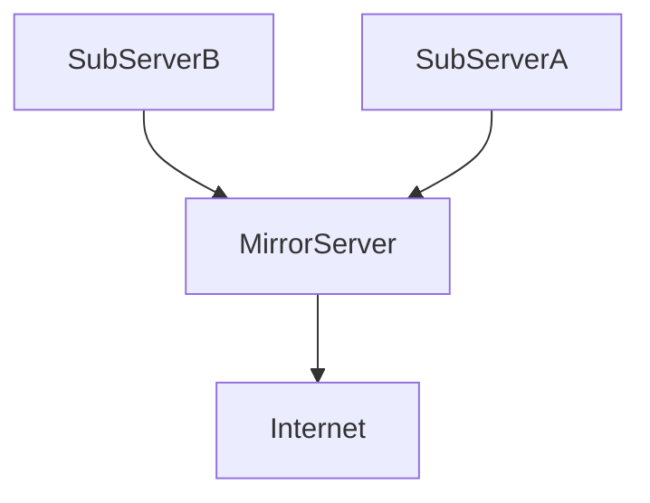

# How to Setup a Local or Private Ubuntu Mirror


## Introduction
By default, Ubuntu systems get their updates straight from the internet at archive.ubuntu.com. In an environment with lots of Ubuntu systems (servers and/or desktops) this can cause a lot of internet traffic as each system needs to download the same updates.

In an environment like this, it would be more efficient if one system would download all Ubuntu updates just once and distribute them to the clients. In this case, updates are distributed using the local network, removing any strain on the internet link

## Why





https://louwrentius.com/how-to-setup-a-local-or-private-ubuntu-mirror.html

## debmirror ubuntu wiki

| Feature | debmirror | apt-mirror | rsync |
| :--- | :--- | :--- | :--- |
| **Primary Use** | Highly configurable repository mirroring. | Simple, full repository mirroring. | General file synchronization. |
| **Configuration** | Command-line flags (easiest for scripts). | Dedicated configuration file (`mirror.list`). | Scripting required for filtering. |
| **Update Efficiency** | Good (uses timestamps/metadata). | Good (uses timestamps/metadata). | **Excellent** (only transfers binary differences). |
| **Complexity** | Medium | Low | High (for repo management) |
| **Best For** | Targeting specific architectures/versions. | Mirroring a complete distribution. | Fast, bandwidth-efficient syncs. | |

https://help.ubuntu.com/community/Debmirror

Since you are dealing with multiple, distinct third-party repositories (Zabbix, xabbix—assuming a second vendor repo, and MySQL), and you need to pull specific packages for a single distribution (Ubuntu 24.04), ***the best all-around tool is debmirror.***

While apt-mirror is simple, it's often designed to mirror an entire distribution, which is overkill and inefficient for just a few vendor repos. Using rsync requires heavy manual scripting to correctly manage the metadata for each separate repository.

debmirror provides the best balance of control, efficiency, and automated metadata handling for this mixed-vendor scenario.


## Virtual machines

dmzdocker03 (mirror master)

* Linux (ubuntu 24.04)
* Standard B2s (2 vcpus, 4 GiB memory)
* VM architecture x64


docker03getmirrortest (using mirror master for zabbx agent apt)

* Linux (ubuntu 24.04)
* Standard B2s (2 vcpus, 4 GiB memory)
* VM architecture x64


## Zabbix Agent Repository Mirroring Guide (Ubuntu 24.04)

This guide provides a complete, step-by-step process for mirroring the Zabbix Debian/Ubuntu repository for a specific version and distribution using debmirror and serving it via Apache.

Scenario Details (for examples):

Zabbix Version: 7.0

Distribution: Noble (Ubuntu 24.04)

Architecture: amd64 (x64)

Mirror Root: /var/www/html/zabbix_mirror

Link used for zabbix agent

https://www.zabbix.com/download?zabbix=7.0&os_distribution=ubuntu&os_version=24.04&components=agent_2&db=&ws=


### 1. Mirror Server Setup & Initial Sync

This section covers the installation of the necessary tools (debmirror and Apache) and the initial synchronization of the repository.

#### 1.1 Install Prerequisites

Install the mirroring tool and the web server on your dedicated mirror server (Ubuntu 24.04 VM).


dmzdocker03

* Linux (ubuntu 24.04)
* Standard B2s (2 vcpus, 4 GiB memory)
* VM architecture x64


```bash
ssh
# Update package lists
sudo apt update

# Install debmirror for synchronization
sudo apt install debmirror

# Install Apache to serve the files via HTTP
sudo apt install apache2

# Install gnupg (gpg) required for GPG key conversion on the client
sudo apt install gnupg

# Ensure Apache starts automatically on boot
sudo systemctl enable apache2

# log it
sudo systemctl status apache2
● apache2.service - The Apache HTTP Server
     Loaded: loaded (/usr/lib/systemd/system/apache2.service; enabled; prese>
     Active: active (running) since Thu 2025-11-13 17:28:16 UTC; 1min 15s ago

```
#### 1.2 Configure Apache Web Root

We need to ensure Apache is pointing to the correct root directory where the packages will be stored. We'll use the default Apache web root.

```bash
# Define the root path (must match the debmirror target)
MIRROR_ROOT="/var/www/html/zabbix_mirror"

# Create the target directory for the Zabbix packages
sudo mkdir -p $MIRROR_ROOT

# Ensure the www-data user (Apache's user) can read the directory structure
sudo chown -R www-data:www-data /var/www/html

cd /var/www/html/zabbix_mirror/
ls
# empty
```

#### 1.3 Create and Run Synchronization Script

It is best practice to wrap the mirroring command in a dedicated shell script. This ensures consistency for the initial run and for the automated cron job later.

First, create the script file: 

```bash
sudo nano /usr/local/bin/sync_zabbix_mirror.sh

```

Inside the file, add the following contents, including the shebang #!/bin/bash for consistency:

```bash
#!/bin/bash

# Configuration Variables
ZABBIX_VERSION="7.0"
DISTRIBUTION="noble"
ARCHITECTURE="amd64"
MIRROR_ROOT="/var/www/html/zabbix_mirror"

# Log file for debmirror output
LOG_FILE="/var/log/zabbix-mirror-sync.log"

echo "$(date): Starting initial mirror sync for Zabbix $ZABBIX_VERSION on $DISTRIBUTION..." | tee -a $LOG_FILE

# The debmirror command. Output is redirected to the log file.
# FIX APPLIED: Changed --root from /zabbix/7.0/debian to /zabbix/7.0/ubuntu
sudo debmirror \
  --host=repo.zabbix.com \
  --root=/zabbix/$ZABBIX_VERSION/ubuntu \
  --method=http \
  --dist=$DISTRIBUTION \
  --arch=$ARCHITECTURE \
  --section=main \
  --progress \
  --ignore-release-gpg \
  $MIRROR_ROOT >> $LOG_FILE 2>&1

EXIT_CODE=$?

if [ $EXIT_CODE -eq 0 ]; then
    echo "$(date): Synchronization completed successfully." | tee -a $LOG_FILE
else
    echo "$(date): Synchronization FAILED with exit code $EXIT_CODE. Check $LOG_FILE for details." | tee -a $LOG_FILE
fi

exit $EXIT_CODE
```

Next, make the script executable:

```bash
sudo chmod +x /usr/local/bin/sync_zabbix_mirror.sh
```

Finally, Run the script for the initial sync:

```bash
sudo /usr/local/bin/sync_zabbix_mirror.sh

```

```log
Thu Nov 13 17:40:50 UTC 2025: Starting initial mirror sync for Zabbix 7.0 on noble...
Thu Nov 13 17:45:01 UTC 2025: Synchronization completed successfully.
```

Check size

```bash
cd /var/www/html
du -sh *

12K     index.html
2.3G    zabbix_mirror

```

#### 1.4 Host GPG Key on Mirror Server (FOR OFFLINE CLIENTS)

To allow offline clients to get the GPG key via the local network, download the key once and place it in the mirror's root directory.

```bash

# Download the GPG key (on the ONLINE Mirror Server)
# FIX APPLIED: Removed Markdown link formatting from the URL
wget https://repo.zabbix.com/zabbix-official-repo.key https://repo.zabbix.com/zabbix-official-repo.key -O /tmp/zabbix-official-repo.key

# 2025-11-13 18:13:13 (3.82 GB/s) - ‘/tmp/zabbix-official-repo.key’ saved [9033/9033]
# FINISHED --2025-11-13 18:13:13--
# Total wall clock time: 0.9s
# Downloaded: 2 files, 18K in 0s (1.90 GB/s)

# Copy the key to the mirror web root so the client can access it locally
sudo cp /tmp/zabbix-official-repo.key /var/www/html/zabbix_mirror/zabbix-official-repo.key

# Clean up the temporary file
rm /tmp/zabbix-official-repo.key

# check it
cd /var/www/html/zabbix_mirror
ls

dists  pool  project  zabbix-official-repo.key
```

#### 1.5 Test Server Access

Verify that the mirrored repository is accessible via HTTP from any client machine. Replace YOUR_MIRROR_SERVER_IP with the actual IP address or hostname of your mirror server.

(Add NSG to public IP allow http 80 for test)

Expected Test URL: http://YOUR_MIRROR_SERVER_IP/zabbix_mirror/

* GPG Key: http://YOUR_MIRROR_SERVER_IP/zabbix_mirror/zabbix-official-repo.key
* Repository Root: http://YOUR_MIRROR_SERVER_IP/zabbix_mirror/


You should be able to browse the contents, specifically seeing directories like dists/ and pool/. If you see a "Forbidden" error, check the permissions in Step 1.2.

(Remove NSG to public IP allow http 80 for test)


### 2. Client Configuration & Test (Offline VM)

This section details how to configure the Zabbix Agent machines (the clients) to use your new local server.

#### 2.0 PREREQUISITE: Install gnupg on Offline Client

If your client VM is offline and does not have the gpg command, you must manually transfer and install the gnupg package.

Step A: Download on Online Mirror Server

```bash
# On the ONLINE Mirror Server, download the necessary packages.
# Create a folder for the transfer files
mkdir -p ~/gnupg_transfer && cd ~/gnupg_transfer

# Download the core packages (dependencies might vary, but this covers the main ones)
# This will save the .deb files locally.
apt-get download gnupg gnupg-l10n libgpg-error0

# After download, transfer the .deb files from ~/gnupg_transfer to the offline client VM.

```

Step B: Transfer and Install on Offline Client VM

```bash
# --- On the ONLINE Mirror Server ---
# 1. Ensure the destination directory exists on the client (using your specific IP and username):
ssh imsdal@172.64.0.5 'mkdir -p ~/gnupg_offline'

# 2. Transfer the files using scp (if network connectivity exists):
scp -r ~/gnupg_transfer imsdal@172.64.0.5:~/gnupg_offline/


# --- On the OFFLINE Client VM ---
# Navigate to the folder where you transferred the .deb files.
exit
ssh imsdal@172.64.0.5
cd ~/gnupg_offline/gnupg_transfer

# Install the packages using dpkg
sudo dpkg -i *.deb
```
#### 2.1 Add the Zabbix GPG Key (Local Transfer)

The client downloads the key from your local mirror and installs it in the trusted directory.

docker03getmirrortest

* Linux (ubuntu 24.04)
* Standard B2s (2 vcpus, 4 GiB memory)
* VM architecture x64

```bash
imsdal@dmzdocker03:~$ ssh imsdal@172.64.0.5

# Replace 172.64.0.4 with your actual mirror server IP
MIRROR_SERVER_IP="172.64.0.4"
KEY_URL="http://$MIRROR_SERVER_IP/zabbix_mirror/zabbix-official-repo.key"

# 1. Create the standard keyring directory
sudo mkdir -p /etc/apt/keyrings

# 2. Download the key from the LOCAL mirror server
wget $KEY_URL -O /tmp/zabbix-official-repo.key

# 2025-11-13 19:09:06 (17.1 MB/s) - ‘/tmp/zabbix-official-repo.key’ saved [18066/18066]]

# 3. Convert the key to the modern signed-by format (dearmor) and move it to keyrings/
# NOTE: This requires 'gpg' to be installed. If not, install it with 'sudo apt install gnupg'
sudo gpg --dearmor -o /etc/apt/keyrings/zabbix-archive-keyring.gpg /tmp/zabbix-official-repo.key

# Clean up the temporary file
rm /tmp/zabbix-official-repo.key

```

#### 2.2 Configure Local Repository Source

Create a new sources file pointing to your local mirror using the noble codename.

```bash
# Replace 172.64.0.4 with your actual mirror server IP
MIRROR_URL="http://172.64.0.4/zabbix_mirror/"
DISTRIBUTION="noble"
COMPONENT="main"

echo "deb $MIRROR_URL $DISTRIBUTION $COMPONENT" | sudo tee /etc/apt/sources.list.d/zabbix-local.list

list.d/zabbix-local.list
deb http://172.64.0.4/zabbix_mirror/ noble main
```

#### 2.3 Test and Install

```bash
# Update package list
sudo apt update

```
Almost there

```log
Reading package lists... Done
W: GPG error: http://172.64.0.4/zabbix_mirror noble InRelease: The following signatures couldn't be verified because the public key is not available: NO_PUBKEY D913219AB5333005
E: The repository 'http://172.64.0.4/zabbix_mirror noble InRelease' is not signed.
N: Updating from such a repository can't be done securely, and is therefore disabled by default.
N: See apt-secure(8) manpage for repository creation and user configuration details.
```

Check sources.list for mirror on the client apt

```bash
cat /etc/apt/sources.list.d/zabbix-local.list
deb http://172.64.0.4/zabbix_mirror/ noble main
```

You found the problem! Your current zabbix-local.list file is indeed missing the necessary signed-by attribute that tells the system where to find the GPG key you installed in Step 2.1.

Step 2.2 Re-run: Configure Local Repository Source

Run this command on the client VM to overwrite the file and correctly specify the key location:

```bash
# Define variables
MIRROR_URL="http://172.64.0.4/zabbix_mirror/"
DISTRIBUTION="noble"
COMPONENT="main"
KEYRING_PATH="/etc/apt/keyrings/zabbix-archive-keyring.gpg"

# The corrected command includes the [signed-by=...] attribute
echo "deb [signed-by=$KEYRING_PATH] $MIRROR_URL $DISTRIBUTION $COMPONENT" | sudo tee /etc/apt/sources.list.d/zabbix-local.list
```

Check sources.list for mirror on the client aptr

```bash
cat /etc/apt/sources.list.d/zabbix-local.list
deb [signed-by=/etc/apt/keyrings/zabbix-archive-keyring.gpg] http://172.64.0.4/zabbix_mirror/ noble main
```
Log with success

```bash
sudo apt update
```

log

```log
Get:1 http://172.64.0.4/zabbix_mirror noble InRelease [3975 B]
Hit:2 http://azure.archive.ubuntu.com/ubuntu noble InRelease
Hit:3 http://azure.archive.ubuntu.com/ubuntu noble-updates InRelease
Hit:4 http://azure.archive.ubuntu.com/ubuntu noble-backports InRelease
Hit:5 http://azure.archive.ubuntu.com/ubuntu noble-security InRelease
Get:6 http://172.64.0.4/zabbix_mirror noble/main all Packages [13.7 kB]
Get:7 http://172.64.0.4/zabbix_mirror noble/main amd64 Packages [73.9 kB]
Fetched 91.6 kB in 1s (162 kB/s)
Reading package lists... Done
Building dependency tree... Done
Reading state information... Done
1 package can be upgraded. Run 'apt list --upgradable' to see it.
```


#### ⚙️ 2.4 Install Zabbix Agent

```bash
# Update packets
sudo apt update -y
# Install agent2
sudo apt install zabbix-agent2

# check it
sudo service zabbix-agent2 status
● zabbix-agent2.service - Zabbix Agent 2
     Loaded: loaded (/usr/lib/systemd/system/zabbix-agent2.service; enabled; preset: enabled)

# enable it
systemctl enable zabbix-agent2
systemctl restart zabbix-agent2

# check it again
sudo systemctl status zabbix-agent2

```

Verify that it uses the mirror server.

If the Get: line starts with http://172.64.0.4/zabbix_mirror/ (or your mirror's actual IP), then the package is being pulled directly from your mirror.

```bash
sudo apt install zabbix-agent2
```
Log

```log

Reading package lists... Done
Building dependency tree... Done
Reading state information... Done
The following NEW packages will be installed:
  zabbix-agent2
0 upgraded, 1 newly installed, 0 to remove and 1 not upgraded.
Need to get 5693 kB of archives.
After this operation, 19.4 MB of additional disk space will be used.
Get:1 http://172.64.0.4/zabbix_mirror noble/main amd64 zabbix-agent2 amd64 1:7.0.21-2+ubuntu24.04 [5693 kB]
Fetched 5693 kB in 0s (79.2 MB/s)
[...]

```

Check Apache Access Logs (Mirror Server Side)

```bash
# exit ssh client vm ssh imsdal@172.64.0.5
exit
imsdal@dmzdocker03:~$ sudo tail -20 /var/log/apache2/access.log
```

Log

```log
172.64.0.5 - - [13/Nov/2025:18:26:30 +0000] "GET /zabbix_mirror/zabbix-official-repo.key HTTP/1.1" 200 18365 "-" "Wget/1.21.4"
172.64.0.5 - - [13/Nov/2025:18:38:06 +0000] "GET /zabbix_mirror/dists/noble/InRelease HTTP/1.1" 200 4180 "-" "Debian APT-HTTP/1.3 (2.8.3) non-interactive"
172.64.0.5 - - [13/Nov/2025:18:42:22 +0000] "GET /zabbix_mirror/zabbix-official-repo.key HTTP/1.1" 200 18365 "-" "Wget/1.21.4"
172.64.0.5 - - [13/Nov/2025:19:09:06 +0000] "GET /zabbix_mirror/zabbix-official-repo.key HTTP/1.1" 200 18365 "-" "Wget/1.21.4"
172.64.0.5 - - [13/Nov/2025:19:10:46 +0000] "GET /zabbix_mirror/dists/noble/InRelease HTTP/1.1" 416 592 "-" "Debian APT-HTTP/1.3 (2.8.3) non-interactive"
172.64.0.5 - - [13/Nov/2025:19:10:46 +0000] "GET /zabbix_mirror/dists/noble/InRelease HTTP/1.1" 200 4180 "-" "Debian APT-HTTP/1.3 (2.8.3) non-interactive"
172.64.0.5 - - [13/Nov/2025:19:18:19 +0000] "GET /zabbix_mirror/dists/noble/InRelease HTTP/1.1" 416 592 "-" "Debian APT-HTTP/1.3 (2.8.3) non-interactive"
172.64.0.5 - - [13/Nov/2025:19:18:19 +0000] "GET /zabbix_mirror/dists/noble/InRelease HTTP/1.1" 200 4180 "-" "Debian APT-HTTP/1.3 (2.8.3) non-interactive"
172.64.0.5 - - [13/Nov/2025:19:18:20 +0000] "GET /zabbix_mirror/dists/noble/main/binary-all/Packages.gz HTTP/1.1" 200 13974 "-" "Debian APT-HTTP/1.3 (2.8.3) non-interactive"
172.64.0.5 - - [13/Nov/2025:19:18:20 +0000] "GET /zabbix_mirror/dists/noble/main/binary-amd64/Packages.gz HTTP/1.1" 200 74178 "-" "Debian APT-HTTP/1.3 (2.8.3) non-interactive"
172.64.0.5 - - [13/Nov/2025:19:22:26 +0000] "GET /zabbix_mirror/dists/noble/InRelease HTTP/1.1" 304 193 "-" "Debian APT-HTTP/1.3 (2.8.3) non-interactive"
```

The presence of the client's IP (172.64.0.5 in this example) requesting Zabbix package files directly from the /zabbix_mirror/ path confirms the mirror is in use.


### 📅 Automating Mirror Synchronization (Cron Job)
Run the following steps on your Mirror Server (where your mirror files are located).

Open the root user's crontab for editing. We use sudo crontab -e because the sync script needs root permissions to write to /var/www/html/zabbix_mirror/

```bash
# exit ssh client vm ssh imsdal@172.64.0.5
exit
sudo crontab -e

# 1 for nano

```
Add to the eof

```log
# Run the Zabbix mirror sync script daily at 3:00 AM (0 3 * * *)
0 3 * * * /usr/local/bin/sync_zabbix_mirror.sh
```

nano output


Verify the job is in the crontab:

```bash
sudo crontab -l
```

Monitor the log file (which your script uses) after 3:00 AM the next morning to confirm a successful run:

```bash
tail /var/log/zabbix-mirror-sync.log
```


### Test sync_zabbix_mirror.sh

```bash

# Run it
sudo /usr/local/bin/sync_zabbix_mirror.sh

# Get logs
tail -20 /var/log/zabbix-mirror-sync.log

```

Verify it in logs and output

```log

[...]
Files to download: 0 B
Downloaded 7901 B in 2s at 3.85 kiB/s.
Everything OK. Moving meta files ...
Cleanup mirror.
All done.
Thu Nov 13 19:42:26 UTC 2025: Synchronization completed successfully.

```